# 🍯 Internet Honeypot Lab

> ¿Qué pasa realmente cuando expones un honeypot a Internet durante casi 24 horas?

[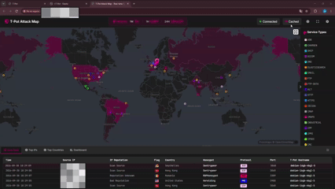](media/attack-map-live-demo.mp4)

<p align="center"><sub>🎥 Tráfico real observado durante el experimento. Las IPs de origen y la IP del VPS han sido censuradas.</sub></p>

---

## 🙌 Créditos

Este laboratorio no existiría sin el trabajo de la comunidad open source.

La plataforma principal utilizada ha sido **T-Pot**, desarrollada y mantenida por **Deutsche Telekom Security GmbH**, junto con los diferentes honeypots y herramientas que integra.

Proyectos principales utilizados:

- **T-Pot** — https://github.com/telekom-security/tpotce
- **T-Pot Attack Map** — https://github.com/telekom-security/t-pot-attack-map
- **Cowrie** — https://github.com/cowrie/cowrie
- **Dionaea** — https://github.com/DinoTools/dionaea
- **Suricata** — https://github.com/OISF/suricata
- **Elastic Stack** — Elasticsearch + Kibana

Todo el mérito por estas herramientas pertenece a sus respectivos autores, mantenedores y contribuidores. Este repositorio documenta **mi despliegue, configuración, exposición, observación y análisis del laboratorio**.

Las licencias de terceros se mantienen bajo sus términos originales. Más info en [`THIRD_PARTY_NOTICES.md`](THIRD_PARTY_NOTICES.md).

---

## 🎯 Objetivo

La idea del proyecto era bastante simple: **poner un honeypot en Internet y ver cuánto tardaba en empezar a recibir tráfico no solicitado.**

En vez de hacer una demo local o generar tráfico artificial, quise desplegarlo en un VPS público, dejarlo expuesto durante casi 24 horas y observar qué ocurría de forma natural.

Quería responder preguntas como:

- ¿Cuánto tarda en aparecer la primera conexión?
- ¿Qué servicios reciben más tráfico?
- ¿Qué protocolos y puertos llaman más la atención?
- ¿Se intentan reutilizar usernames y passwords típicos?
- ¿Llegan a introducir comandos?
- ¿Desde qué infraestructuras y geolocalizaciones aparecen las conexiones?
- ¿Cuánto tráfico puede recibir un servidor recién expuesto en menos de un día?

El objetivo era **observar y aprender**, no interactuar con sistemas de origen ni realizar ningún tipo de contraataque.

---

## ⚡ Resultado rápido

Después de casi 24 horas:

| Métrica | Resultado |
|---|---:|
| Eventos registrados por T-Pot | ~105.000 |
| Eventos visibles en Attack Map al cierre | 105.057 |
| Eventos de Cowrie | 34.745 |
| IPs de origen únicas en Cowrie | 248 |
| Hashes únicos en Cowrie | 19 |
| Coste total del laboratorio | 3,39 € |
| Duración | ~24 horas |

Empezamos literalmente desde esto:


**0 eventos.**

Y terminamos así:

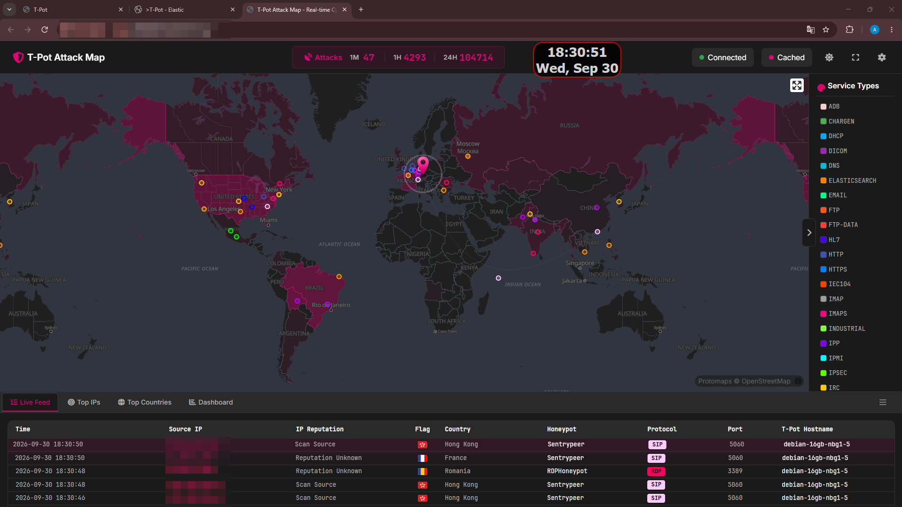

---

## 🧪 El laboratorio

Para el experimento utilicé un VPS completamente separado de cualquier infraestructura personal.

| Componente | Configuración |
|---|---|
| Cloud provider | Hetzner Cloud |
| Región | Nuremberg, Germany |
| Instancia | CPX42 |
| CPU | 8 vCPU |
| RAM | 16 GB |
| Disco | 320 GB NVMe |
| Arquitectura | x86-64 |
| Sistema operativo | Debian GNU/Linux 13 |
| Plataforma honeypot | T-Pot 24.04.1 |
| Virtualización | KVM |

La máquina no tenía información personal, servicios reales ni acceso a ninguna red privada. Era un VPS creado únicamente para este proyecto y destinado a ser destruido al terminar.

---

## 🏗️ Arquitectura

```text
                        Internet
                            │
                            ▼
                  ┌─────────────────┐
                  │ Hetzner Firewall │
                  └────────┬────────┘
                           │
                           ▼
                 ┌───────────────────┐
                 │ Debian 13 VPS     │
                 │ T-Pot 24.04.1     │
                 └─────────┬─────────┘
                           │
          ┌────────────────┼─────────────────┐
          │                │                 │
          ▼                ▼                 ▼
       Cowrie           Dionaea         SentryPeer
      SSH/Telnet      Multi-service         SIP
          │
          ├───────────────┐
          │               │
          ▼               ▼
     Elasticsearch      Suricata
          │
          ▼
       Kibana
          │
          ├───────────────► Dashboards
          └───────────────► T-Pot Attack Map
```

T-Pot levantaba diferentes honeypots en contenedores Docker y centralizaba los eventos en Elasticsearch/Kibana.

---

## 🔐 Seguridad y aislamiento

Exponer un honeypot a Internet tiene riesgo, así que separé el despliegue en dos fases.

### Fase BUILD

- Honeypots no expuestos públicamente.
- SSH administrativo permitido únicamente desde mi IP.
- WebUI de T-Pot restringida a mi IP.
- Sin red privada conectada al VPS.
- Clave SSH dedicada al laboratorio.
- Sin datos personales ni credenciales reales en el servidor.

### Fase EXPOSE

- SSH administrativo siguió restringido.
- WebUI siguió restringida.
- Solo se publicaron puertos asociados a honeypots.
- Kibana, Elasticsearch y servicios internos no quedaron accesibles directamente desde Internet.
- El laboratorio se mantuvo aislado hasta terminar la observación.

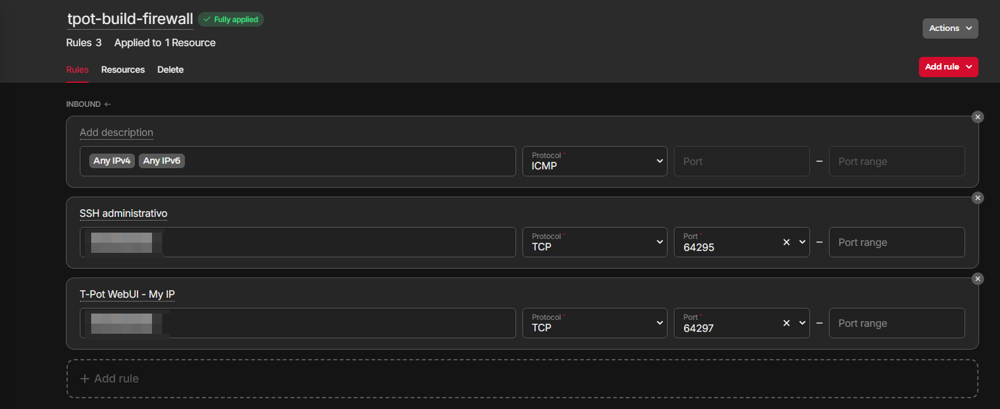

Más detalle en [`docs/03-security-hardening.md`](docs/03-security-hardening.md).

---

## 🚀 Instalación de T-Pot

```bash
git clone https://github.com/telekom-security/tpotce.git
cd tpotce
```

Versión utilizada:

```text
T-Pot version: 24.04.1
Commit: 5d95017d3ce7e8a0ecea8655cb8ac69c0d7b800f
Branch: master
```


La instalación se ejecutó con:

```bash
./install.sh
```

Seleccioné:

```text
HIVE / T-Pot Standard
```


Después de instalar, SSH administrativo pasó a:

```text
64295/tcp
```

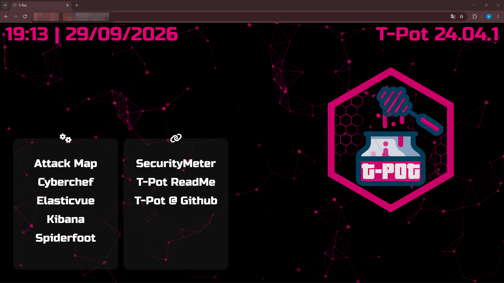

---

## 🌐 T0 — Exposición a Internet

Antes de publicar ningún honeypot hice una captura base del Attack Map:

```text
1M:  0
1H:  0
24H: 0
```


El primer servicio que publiqué fue **Cowrie** con:

```text
TCP 22
TCP 23
```

A partir de ese momento comenzó oficialmente el periodo de observación.

---

## 👀 Primera conexión

Poco después de exponer Cowrie apareció la primera conexión espontánea:

```text
Timestamp: 2026-09-29 19:47:14
Honeypot: Cowrie
Protocol: Telnet
Destination port: 23
Source IP geolocation: United States
T-Pot reputation label: Bad Reputation
```


La geolocalización corresponde a la **IP de origen observada**. No demuestra la identidad, nacionalidad o ubicación física de una persona.

---

## 📈 Primeros minutos

A los pocos minutos ya aparecían eventos relacionados con:

```text
SSH
Telnet
HTTP
SMB
```


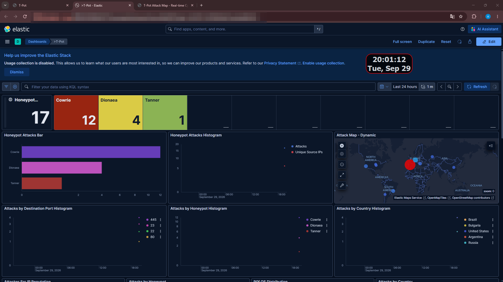

---

# 📊 Resultados después de casi 24 horas

Al finalizar el experimento, el contador del Attack Map había superado los **105.000 eventos**. Una captura concreta realizada al cierre mostraba:

```text
24H: 105057
```

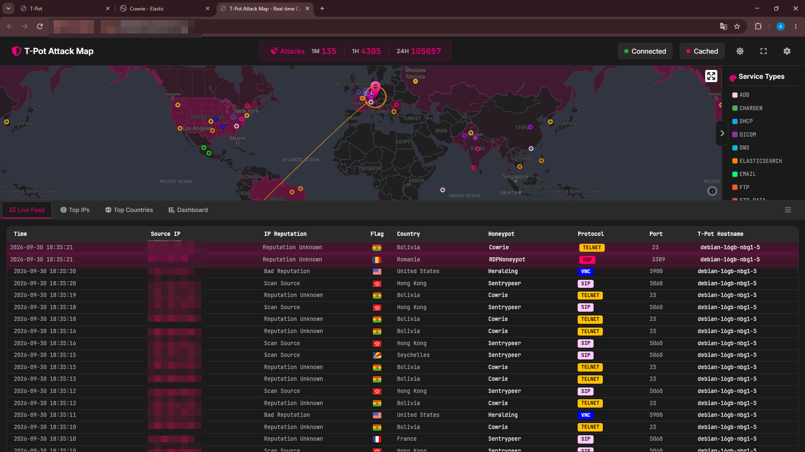

**105.057 eventos no significa 105.057 atacantes.** Una misma IP puede generar cientos o miles de eventos.

## 🍯 Distribución por honeypot

| Honeypot | Eventos |
|---|---:|
| Cowrie | ~35k |
| Dionaea | ~34k |
| SentryPeer | ~18k |
| Heralding | ~13k |
| HoneyAML | ~2k |
| Tanner | ~1k |
| RDPHoneypot | 652 |
| ConPot | 215 |
| h0neytr4p | 163 |
| ADBHoney | 150 |

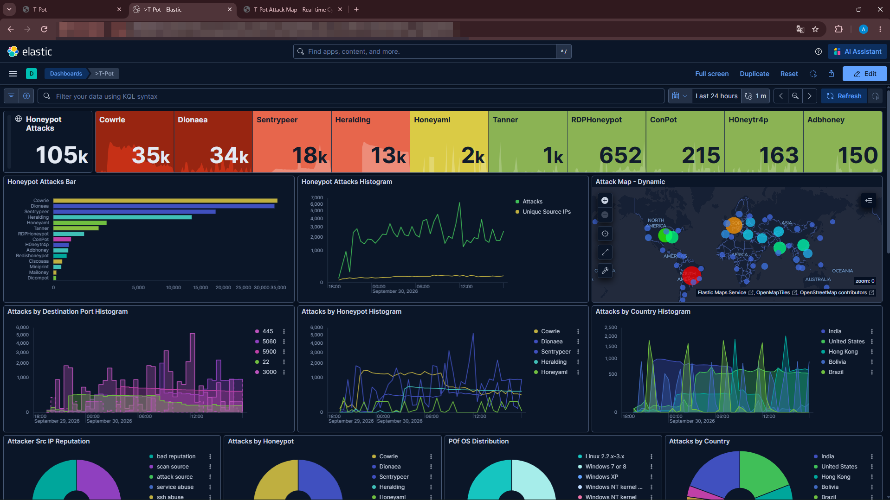

---

# 🐚 Cowrie — SSH y Telnet

Cowrie terminó con:

```text
Cowrie events:        34,745
Unique source IPs:       248
Unique hashes:            19
```

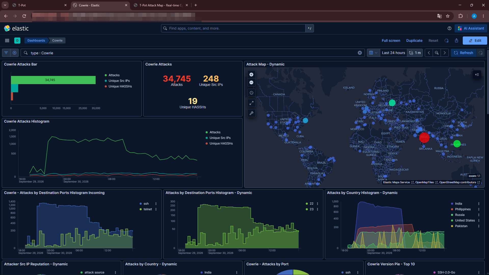

Esto deja clara una diferencia importante:

```text
34.745 eventos != 34.745 atacantes
```

---

## 🔑 Usernames y passwords observados

Al principio estos paneles estaban vacíos:

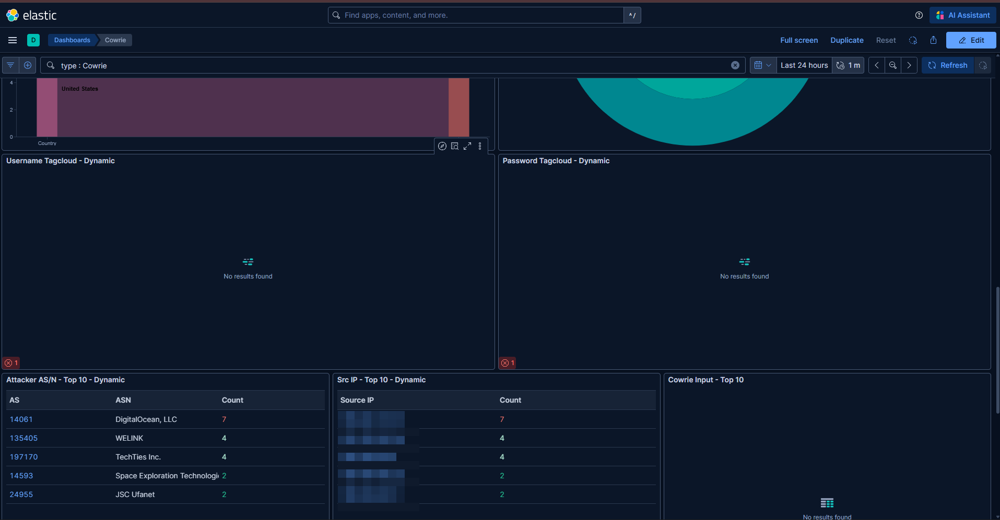

Horas después aparecieron ejemplos como:

```text
root
admin
user
Administrator
support
guest
operator
service
default
```

Y passwords como:

```text
admin
1234
password
123456
12345678
admin1234
root
user
default
```

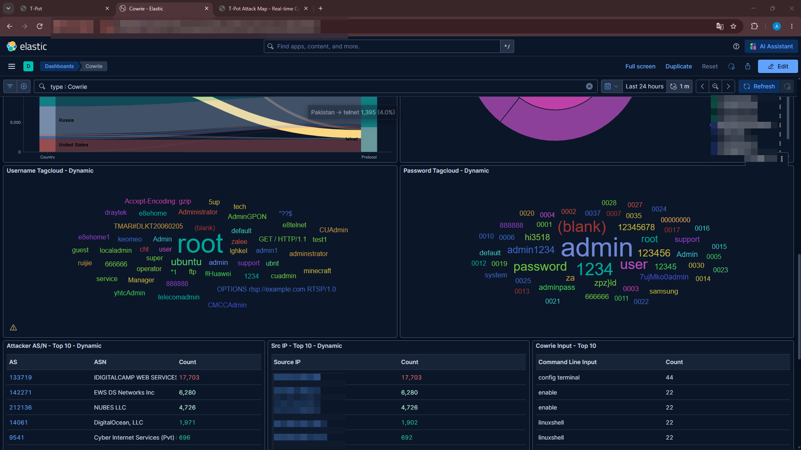

La intención es analizar patrones, no asociar credenciales a personas concretas.

---

## 💻 Comandos observados

Cowrie también registró entradas enviadas a sesiones simuladas, entre ellas:

```text
config terminal
enable
linuxshell
```

Durante todo el análisis:

- no ejecuté payloads;
- no descargué malware;
- no abrí URLs observadas;
- no intenté contactar con las IPs de origen.

El laboratorio fue completamente pasivo desde mi lado.

---

## 🌍 Geolocalización

Entre las geolocalizaciones visibles en los dashboards aparecieron, por ejemplo:

```text
India
United States
Hong Kong
Bolivia
Brazil
Russia
Philippines
Pakistan
France
Romania
```

Esto representa la geolocalización asociada a las IPs observadas, no la nacionalidad de una persona.

---

## 🚪 Puertos destacados

Entre los puertos que destacaban en el dashboard general estaban:

```text
445   SMB
5060  SIP
5900  VNC
22    SSH
3000  application/web service
```

Cowrie recibió actividad en `22/tcp` y `23/tcp`.

---

## 🎥 Attack Map en tiempo real

[](media/attack-map-live-demo.mp4)

Para la versión pública:

```text
✔ Source IPs censuradas
✔ IP del VPS censurada
✔ Sin credenciales administrativas
✔ Sin información personal
```

---

## 📉 Evolución del experimento

```text
PRE-EXPOSURE
     │
     │  0 eventos
     ▼
Cowrie 22/23 público
     │
     ▼
Primera conexión
Telnet / 23
     │
     ▼
SSH + Telnet + HTTP + SMB...
     │
     ▼
Decenas de eventos
     │
     ▼
Miles de eventos
     │
     ▼
~105.000 eventos
     │
     ▼
Teardown completo
```

---

# 💸 Coste

El consumo final mostrado por Hetzner fue:

# **3,39 €**

IVA incluido.

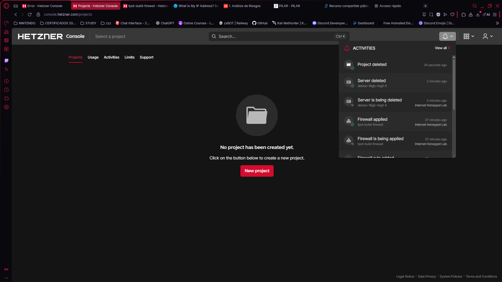

Este precio corresponde únicamente a esta ejecución concreta del laboratorio.

---

# 🧹 Teardown

Cuando terminé de recoger métricas:

1. Guardé capturas y resultados.
2. Confirmé que no necesitaba más datos.
3. Eliminé el proyecto completo de Hetzner.
4. El servidor fue destruido.
5. Primary IPv4 e IPv6 fueron eliminadas.
6. El firewall fue eliminado.
7. Confirmé que no quedaban proyectos activos.

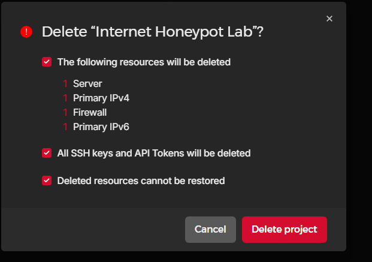

---

# 💭 Qué me llevo del proyecto

Este laboratorio me ha servido para tocar varias cosas a la vez:

```text
Linux
Docker
Cloud
Firewalls
SSH hardening
Honeypots
Elastic Stack
Kibana
Network telemetry
Threat observation
Data analysis
Incident-style documentation
OPSEC
```

Lo que más me sorprendió fue ver lo poco que tarda un sistema expuesto a Internet en empezar a recibir tráfico automático.

---

# ⚠️ Limitaciones

- **IP ≠ persona**.
- **Geolocalización ≠ ubicación física demostrada**.
- **Evento ≠ atacante**.
- Un honeypot emula servicios y no se comporta exactamente como producción.
- La ventana fue de solo ~24 horas.
- Los resultados dependen de puertos, región, proveedor, IP asignada y honeypots usados.

---

# 🔒 Consideraciones de seguridad

No recomiendo desplegar un honeypot público sin entender antes los riesgos.

Este laboratorio se desplegó en un VPS aislado y desechable. Nunca debe utilizarse para:

```text
hack-back
counterattacks
port scanning against observed IPs
malware execution
unauthorized access
```

---

# 📁 Estructura del repositorio

```text
internet-honeypot-lab/
├── README.md
├── LICENSE
├── SECURITY.md
├── THIRD_PARTY_NOTICES.md
├── configs/
├── data/
├── diagrams/
├── docs/
├── media/
├── screenshots/
└── scripts/
```

---

# 📖 Documentación

| Documento | Contenido |
|---|---|
| [`01-architecture.md`](docs/01-architecture.md) | Arquitectura y diseño |
| [`02-vps-deployment.md`](docs/02-vps-deployment.md) | Creación del VPS |
| [`03-security-hardening.md`](docs/03-security-hardening.md) | Firewall y aislamiento |
| [`04-tpot-installation.md`](docs/04-tpot-installation.md) | Instalación de T-Pot |
| [`05-public-exposure.md`](docs/05-public-exposure.md) | Puertos y T0 |
| [`06-data-analysis.md`](docs/06-data-analysis.md) | Kibana y métricas |
| [`07-findings.md`](docs/07-findings.md) | Resultados |
| [`08-cleanup.md`](docs/08-cleanup.md) | Teardown |
| [`lab-journal.md`](docs/lab-journal.md) | Diario cronológico |

---

# 🛡️ Uso responsable

Este repositorio tiene fines educativos, defensivos y de aprendizaje. No contiene malware, payloads operativos ni credenciales reales.

---

## 👨‍💻 Autor

Proyecto realizado como laboratorio práctico personal de ciberseguridad.

Si has llegado hasta aquí: gracias por leerlo :)
