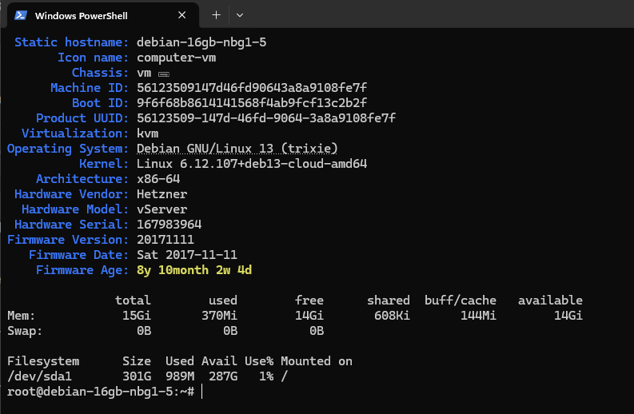
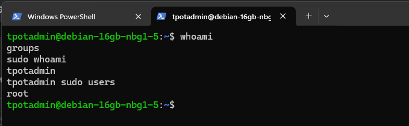

# 02 — Despliegue del VPS

## Configuración

```text
Location: Nuremberg
Server: CPX42
OS: Debian GNU/Linux 13
Architecture: x86-64
Public IPv4: enabled
Public IPv6: enabled
Private network: disabled
Backups: disabled
Additional volumes: none
```

Antes de instalar T-Pot comprobé el estado inicial del servidor.



Creé el usuario administrativo `tpotadmin` y confirmé que pertenecía al grupo sudo.



La idea era que el VPS fuese temporal, aislado y desechable.
