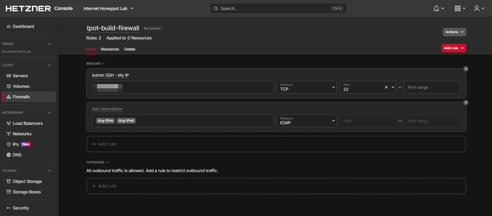
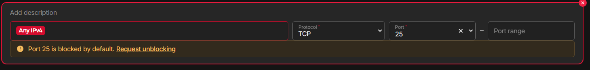

# 03 — Seguridad y aislamiento

Dividí el firewall en dos estados: `BUILD` y `EXPOSE`.

## BUILD

```text
SSH admin       -> permitido solo desde mi /32
T-Pot WebUI     -> permitido solo desde mi /32
Honeypots       -> no expuestos
Kibana          -> no público
Elasticsearch   -> no público
Attack Map      -> acceso mediante T-Pot
```



Después de instalar T-Pot, SSH pasó al puerto `64295/tcp` y la WebUI quedó en `64297/tcp`, ambos restringidos.


## EXPOSE

Los servicios honeypot se fueron publicando de forma progresiva. Las interfaces administrativas permanecieron restringidas durante todo el experimento.

TCP/25 permaneció bloqueado por el proveedor y no solicité su desbloqueo.


