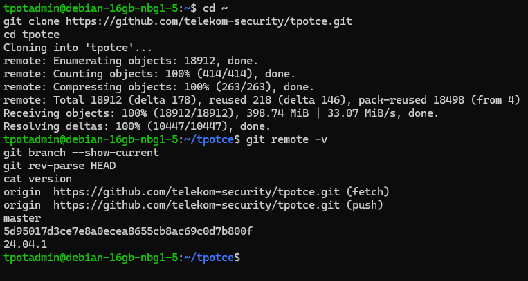
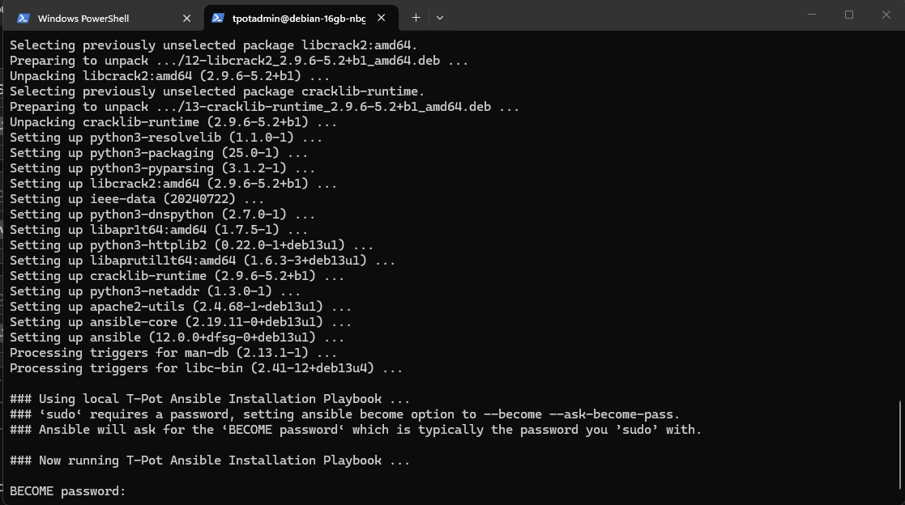

# 04 — Instalación de T-Pot

```bash
git clone https://github.com/telekom-security/tpotce.git
cd tpotce
./install.sh
```

Versión exacta:

```text
Version: 24.04.1
Branch: master
Commit: 5d95017d3ce7e8a0ecea8655cb8ac69c0d7b800f
```



Seleccioné `HIVE / T-Pot Standard`.



La fase previa de Ansible terminó con `failed=0` y el nuevo SSH administrativo quedó en `tcp/64295`.
