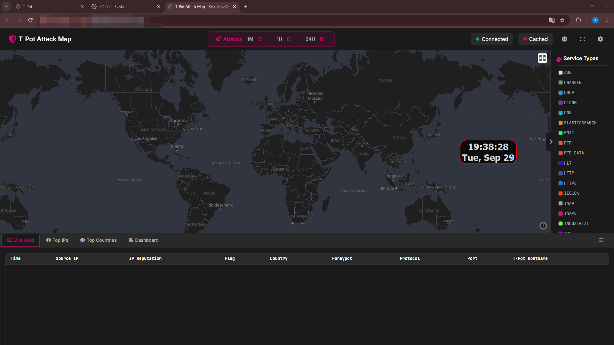
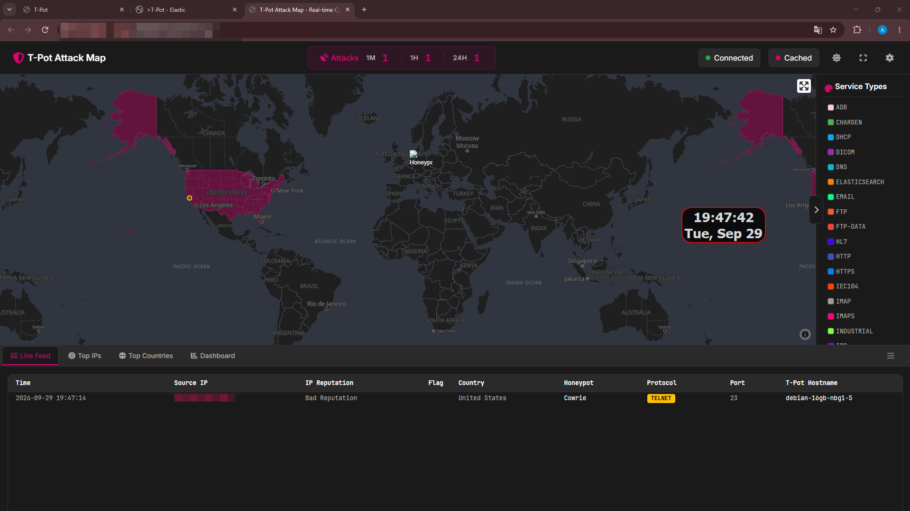
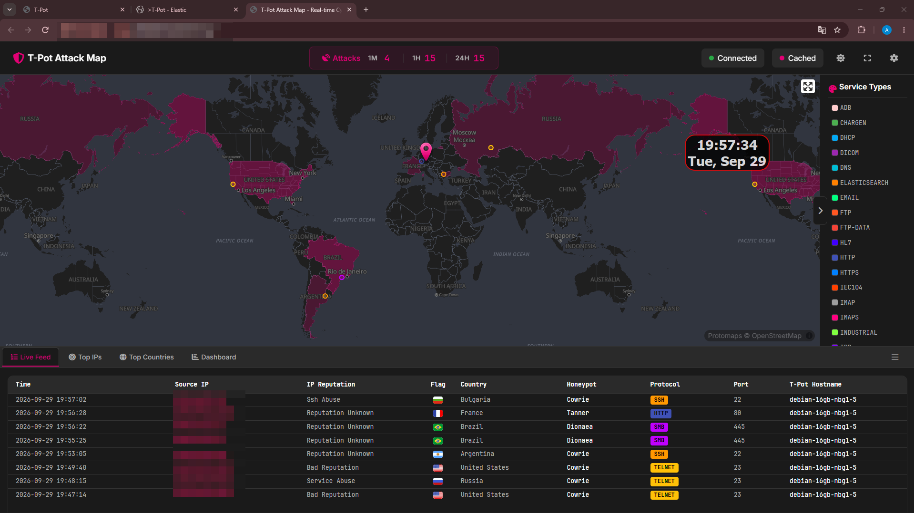

# 05 — Exposición pública

Antes de abrir ningún honeypot:

```text
1M: 0
1H: 0
24H: 0
```



La primera regla pública habilitó `TCP 22` y `TCP 23` para Cowrie.

No guardé el segundo exacto en el que Hetzner aplicó la regla, así que no intento inventar uno posteriormente.

La primera conexión registrada apareció a `2026-09-29 19:47:14` usando Cowrie/Telnet/23.



Pocos minutos después ya aparecían eventos SSH, Telnet, HTTP y SMB.


